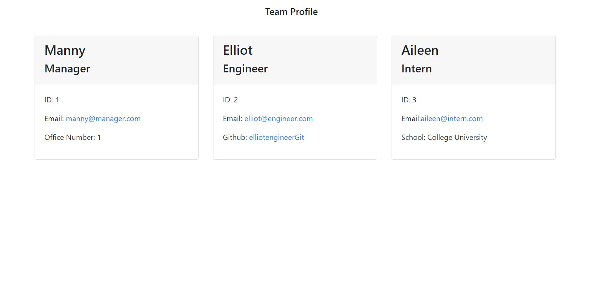

# 10-OOP-Homework-TeamProfileGenerator
Unit 10 Team Profile generator Homework

The goal of this homework was to build a team generator from scratch using javascript, node, inquirer, and jest for testing. After being launched the program works buy gathering information from the user using Inquierer prompts, then automatically builds an html web page using the inputted information.

## Installation and Use
After pulling the repository to a file on their local machine, users can launch the program through a code terminal by navigating to 10-OOP-Homework-TeamProfileGenerator\md and running the command "node index.js".

They can also run the program through the terminal in VS Code by opening the code  terminal and running the command "node index.js".

## User Story and Acceptance Criteria

```md
AS A manager
I WANT to generate a webpage that displays my team's basic info
SO THAT I have quick access to their emails and GitHub profiles
```

```md
GIVEN a command-line application that accepts user input
WHEN I am prompted for my team members and their information
THEN an HTML file is generated that displays a nicely formatted team roster based on user input
WHEN I click on an email address in the HTML
THEN my default email program opens and populates the TO field of the email with the address
WHEN I click on the GitHub username
THEN that GitHub profile opens in a new tab
WHEN I start the application
THEN I am prompted to enter the team manager’s name, employee ID, email address, and office number
WHEN I enter the team manager’s name, employee ID, email address, and office number
THEN I am presented with a menu with the option to add an engineer or an intern or to finish building my team
WHEN I select the engineer option
THEN I am prompted to enter the engineer’s name, ID, email, and GitHub username, and I am taken back to the menu
WHEN I select the intern option
THEN I am prompted to enter the intern’s name, ID, email, and school, and I am taken back to the menu
WHEN I decide to finish building my team
THEN I exit the application, and the HTML is generated
```

## Project Links
Below are links to the git repository, and a video demonstration of the application.


* [Github](https://github.com/dearg-amadaun/11-Express-Homework-Note-Taker)
* [Video Demonstration](https://drive.google.com/file/d/11NxdmW9mHylIjRbQPuM80ccw55T0k_26/view)


## Programs Used

* [VSCode](https://code.visualstudio.com/)
* [MDN](https://developer.mozilla.org/en-US/)
* [NodePackageManager](https://www.npmjs.com/)
* [Inquirer](https://www.npmjs.com/package/inquirer)
* [Jest](https://www.npmjs.com/package/jest)


##Credits
Many thanks to my tutor Javier Perez for helping me work through some of the harder javascript and finally helping me to understand how jest test writing works.


<!-- ## License
This project is licensed under the MIT License - see the [LICENSE.md](LICENSE.md) file for details -->
